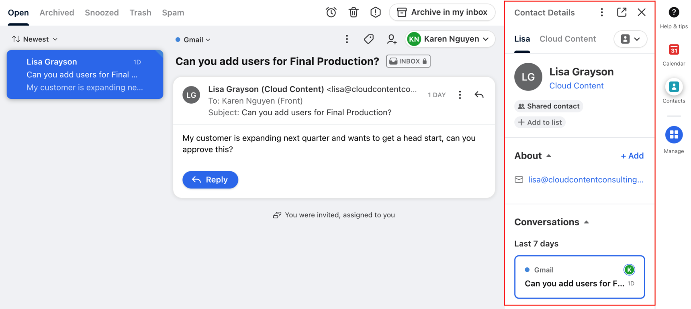

## <i style="color:blue" class="fa-regular fa-comments"></i>  Chat

Front offers a Chat feature that we can integrate into certain webpages. This would allow us to quickly handle tasks quickly or decide if they need to go to another department, before ever reaching an inbox. The chat function could require users to be logged in to a chosen page before showing them the option to chat, so we could filter users and authenticate quickly and securely.

   

## <i style="color:#1F5FBF" class="fa-brands fa-salesforce"></i>  Salesforce 

Front integrates with salesforce, so we can continue logging emails as we do today, but see relevant information about the company and contact, without leaving the mailbox.

  

## <i style="color:#0052CC" class="fa-brands fa-jira"></i>  JIRA 

Associate JIRA tickets directly to conversations to track the status of a ticket. Co-workers can see the status of these tickets if a teammate is out of office without having to sort through open issues.

  

## <i class="fa-solid fa-tags"></i>  Email Tagging 

  

## <i style="color:green" class="fa-solid fa-copy"></i>  Saved Responses 

  

## <i class="fa-solid fa-chart-simple"></i> Analytics

<video loop="" autoplay="" playsinline="" width="100%"><source src="https://front.com/assets/solution-pages/Product-Videos/Solutions_Customer-Satisfaction-1180x852.mp4"></video>

	

