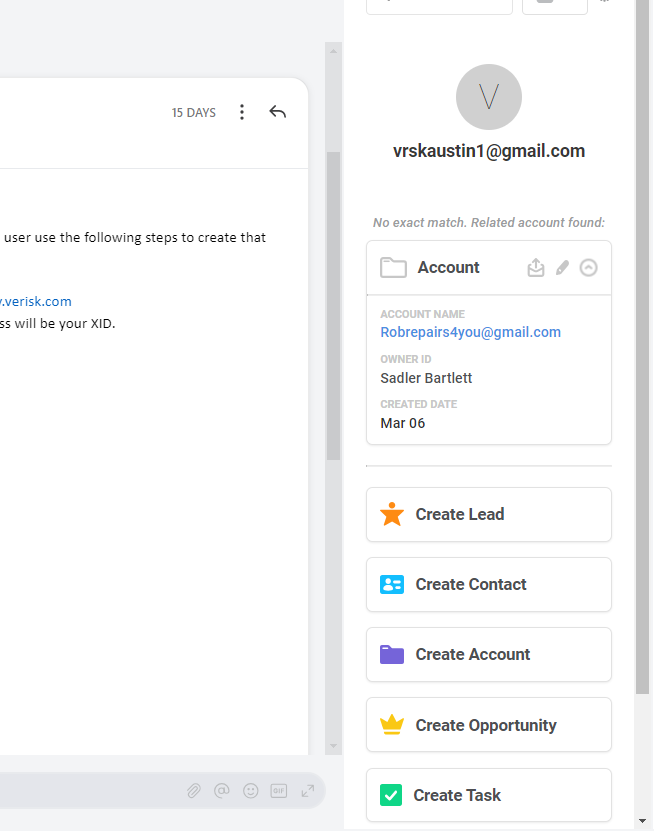
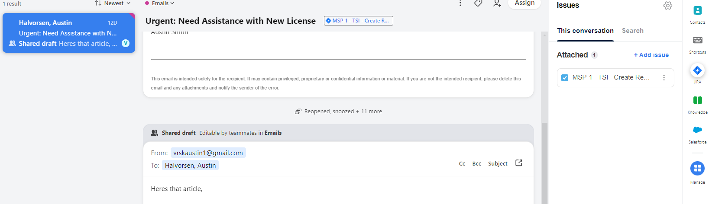
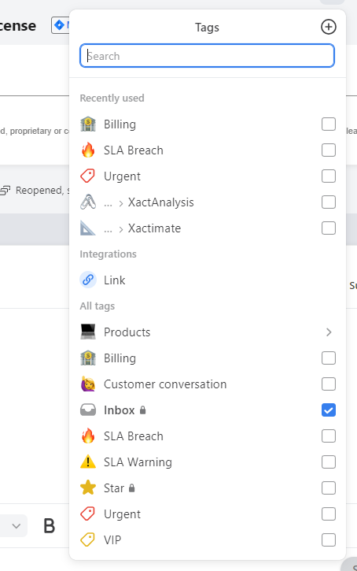
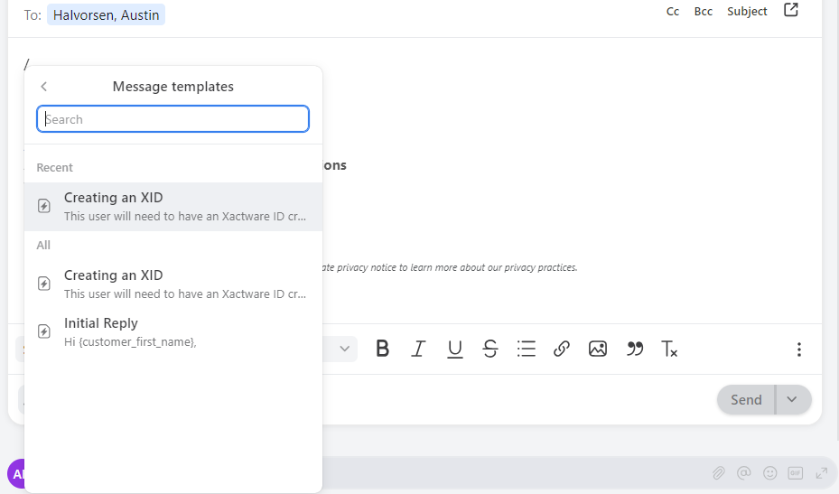

## <i style="color:blue" class="fa-regular fa-comments"></i>  Chat

Front offers a Chat feature that we can integrate into certain webpages. This would allow us to quickly handle tasks quickly or decide if they need to go to another department, before ever reaching an inbox. The chat function could require users to be logged in to a chosen page before showing them the option to chat, so we could filter users and authenticate quickly and securely.

   

## <i style="color:#1F5FBF" class="fa-brands fa-salesforce"></i>  Salesforce 

The Salesforce integration with Front empowers Account Changes to seamlessly continue logging emails. By integrating Salesforce with Front, we can effortlessly sync customer data and interactions, ensuring a comprehensive view of each client's history and needs. This integration enables us to continue utilizing Front's intuitive tagging system to categorize and prioritize emails based on customer attributes, inquiry types, or sales stages. With access to real-time customer insights and streamlined email management, our team can deliver personalized and timely responses, driving productivity and strengthening client relationships.

  

## <i style="color:#0052CC" class="fa-brands fa-jira"></i>  JIRA 

With the Front/JIRA integration, we can seamlessly associate JIRA tickets directly with conversations, enabling efficient tracking of ticket statuses. This increased visibility ensures that colleagues can easily access the status of ongoing tickets, even when a teammate is out of the office, eliminating the need to sift through open issues.

  

## <i class="fa-solid fa-tags"></i>  Email Tagging 

Optimize customer support workflows with Front's email tagging feature. Quickly categorize and identify customer inquiries to respond promptly and effectively.

Front's intuitive tagging system simplifies organization, ensuring no query goes unnoticed. Customize email routing, response times, and urgency levels effortlessly with user-friendly tagging rules.

Leverage Front.com to streamline customer support processes and elevate service standards. Empower your team to deliver timely, personalized assistance and exceed customer expectations effortlessly.

  

## <i style="color:green" class="fa-solid fa-copy"></i>  Saved Responses 

Front's Template Message feature facilitates consistent and efficient customer communications by providing predefined message templates. With this tool, our team can swiftly access and personalize messages for common inquiries, reducing response times and ensuring a unified brand voice. Centralized template management ensures that our team is always equipped with up-to-date and on-brand messaging, fostering trust and loyalty among customers.

  

## <i class="fa-solid fa-chart-simple"></i> Analytics

Front's analytics reporting is not just a feature; it's a powerful tool that empowers businesses to make data-driven decisions with confidence. With Front's robust analytics capabilities, users gain deep insights into their communication patterns, team performance, and customer interactions. From tracking response times to identifying trends in customer inquiries, Front's analytics reporting provides invaluable intelligence to optimize workflows, improve efficiency, and enhance customer satisfaction. By harnessing the power of data, businesses can unlock new opportunities for growth and innovation. Choose Front's analytics reporting and unlock the potential to propel your business forward.
  

<video loop="" autoplay="" playsinline="" width="100%"><source src="https://front.com/assets/solution-pages/Product-Videos/Solutions_Customer-Satisfaction-1180x852.mp4"></video>

